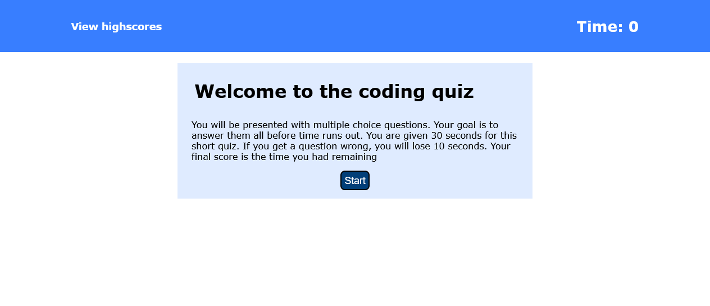

# hw04-code-quiz

## Description

This is homework assignment 4

We were tasked with creating a timed code quiz.

The user starts a timed quiz and must answer answers correctly and quickly to finish with a high score.

If the user gets a question wrong, they have time deducted, and lowering their score.

After the user completes the quiz, they can submit their initials to a persistent leaderboard.

## Site link

The link to the deployed application can be found **[https://nathanhentges.github.io/hw04-code-quiz/](https://nathanhentges.github.io/hw04-code-quiz/)**.

## Website preview

Below is a screenshot preview of the final website.

